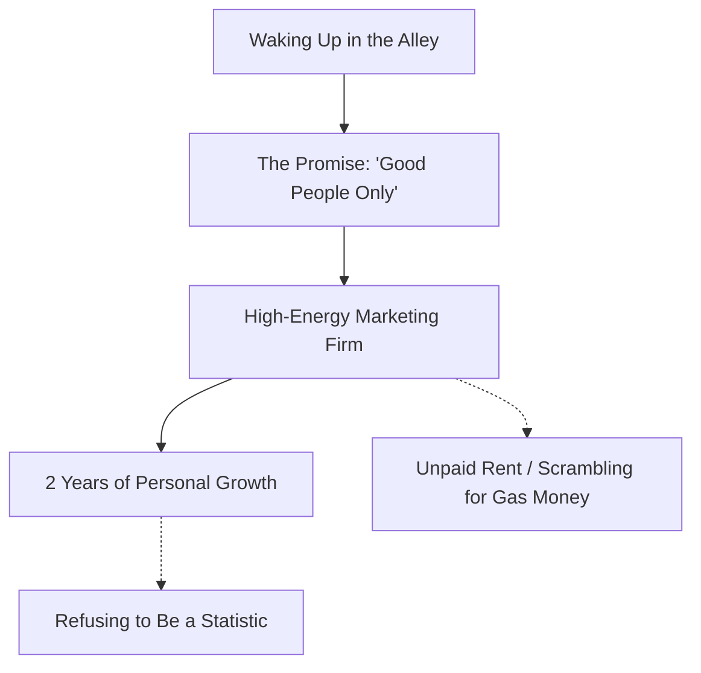
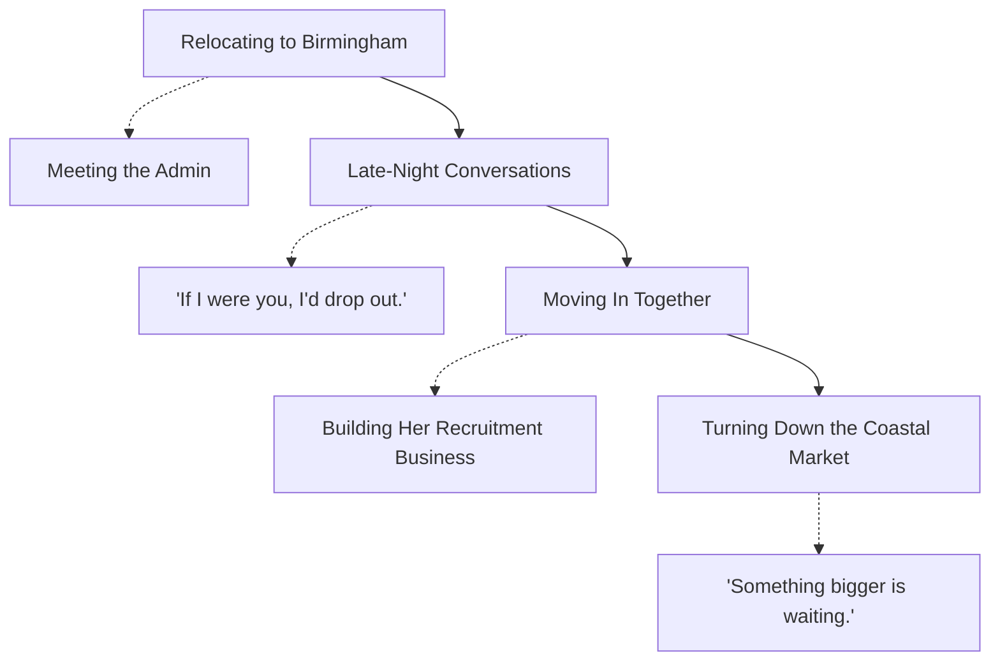
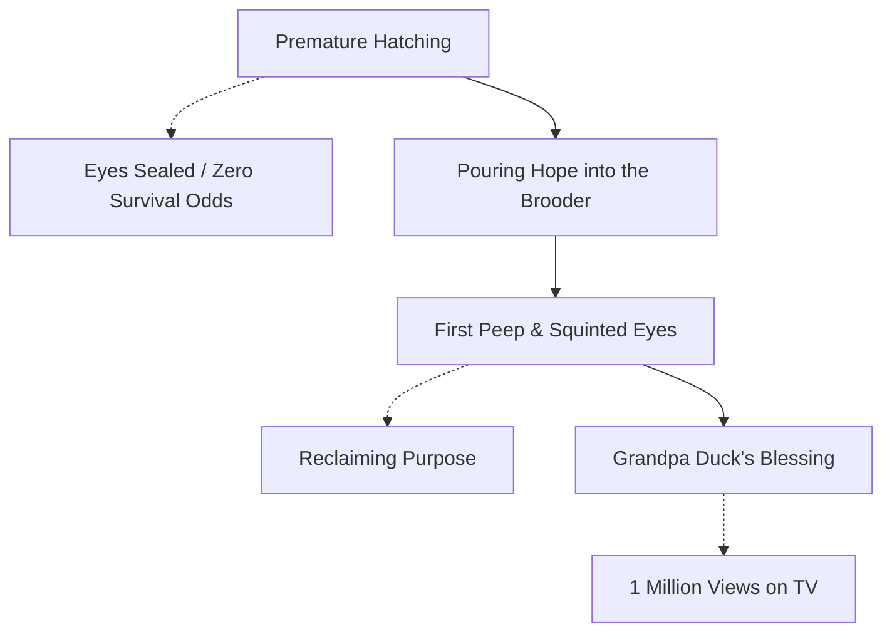
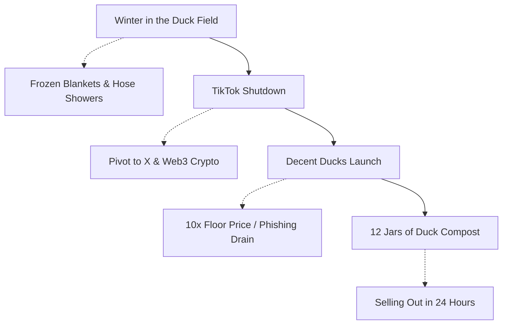

There’s a specific kind of grit that only exists when you have no safety net.

Most of us didn’t grow up with a silver spoon in our mouths. If anything, we grew up with plastic silverware. Sometimes rusty plastic silverware—if that even makes sense. But when you start with nothing, you learn early on that the only person responsible for changing your trajectory is the person looking back at you in the mirror.

Over the course of life, there are moments where every single option evaporates until only one remains: **betting on yourself**.

It’s not about flashy status symbols, and it’s not about living up to someone else's definition of success. It’s about the quality of life you get to live, the purpose you build out of thin air, and the refusal to fold when every card dealt to you is garbage.

---

## The Concrete, The Suits, and The Commission Floor

High school wasn't about academics. It was a test of survival—doing just enough to get by, making friends, flirting with girls in class so they’d help with the coursework, and sitting through summer school just to get a piece of paper. Why take a class like English seriously when your main language is already English? Reading silly books we never actually opened... anyways, we made it happen. We got through high school.

*Kyle Kinkin, founder of JustDuckit and Decent Ducks, holding a sanctuary bird.*

The standard playbook says: go to university, get a job while you’re there, and fall in line. But when I made it to the bookstore to buy textbooks, I stood there and made a quiet decision: **College isn't for everybody.**

So that’s what I did. I worked low-end jobs, met different people, and tried to find my way.

Then came the turning point. I woke up face down on cold concrete in a pitch-black Chicago back alley—barely conscious, confused, and disoriented. The only thing visible was a shimmering light further down the alleyway. Just like in a movie, I stumbled toward it until I ran into the last guy I remembered seeing before going unconscious.

He looked at me and said, "You look messed up."

I was. Blood was dripping down my face, leaving a scar on my forehead that I still carry to this day. He walked me to my car, drove us back to his place, and from there, I drove myself home. Looking in the rearview mirror that night, I made a promise: **Only good things and good people from here on out.**

### The Next Day

While scrolling Facebook shortly after, I saw a kid I went to high school with posting photos wearing sharp suits and smiling. I thought, *That seems like something I want to do. I'd love to put on a suit and grow in a professional career.*

I reached out, set up an interview, put together some nice clothes, and showed up. It turned out it wasn't his business, but a major marketing firm run by a director who had been in business for five years, managing nine territories across five states. The music was bumping, the energy was electric, and everything just felt right. I walked in with one superpower: assuming I already had the position.

I got the call back and got offered the job. I came in bushy-tailed, bright-eyed, and excited.

Working there for two years pushed me to fight personal demons. Being around people from all over the Chicagoland area—different upbringings, different backings—navigating a major city forced me to grow up fast. I learned sales, but more importantly, I learned how to hold myself accountable: waking up on time and keeping a positive attitude when it didn't come naturally.

There were plenty of times I couldn't pay rent. Times I had to ask for gas money just to drive to a new sales territory because my commissions from the week prior hadn't hit yet. In an industry with brutal turnover where people constantly quit, I refused to be another statistic. I wanted to see the opportunity all the way through and eventually open my own firm.

It also created friction. Putting on a suit, dressing nice, and speaking properly brought pushback from family—it felt like I was pretending to be someone other than myself to them. Which I was: I was young, dumb, and motivated.

> [!NOTE]
> **Gibson Steakhouse Regional Leaders Meeting**
> Early career sales dinners representing milestones in fast-paced professional environments.

---

## 2020, Young Love, and Turning Down the Safe Route

Then 2020 hit. COVID shut the entire operation down. Deemed "unnecessary" to the job market, I tucked my tail between my legs and moved from Chicago to Tennessee to live with my mom.

We didn't see eye-to-eye. After being coached and independent for two years, living under her and her new husband's roof didn't work smoothly. For six months, while nobody was working, I just sat and played video games, becoming part of a massive online gaming community. During a trip down to Florida with old high school friends, I ended up with my first DUI—a very fun, expensive six months of doing nothing and holding myself accountable for bad decisions.

When the industry finally opened back up, I called a director of operations in the area, joined a new organization, and started from the bottom again. Armed with Chicago experience, I quickly became one of the top sales reps in the state, speaking on corporate Zoom calls after just two months.

That led to an offer from the organization head to relocate to Birmingham, Alabama. We packed our bags, drove down, and stayed in a hotel for Thanksgiving.

And that’s where I met her.

She was hired as an admin doing a completely different job. We didn't have anywhere to stay, so she offered us her hotel room. The next morning, I woke up to her rifling through my bags, reading all the corporate notes I’d taken from national directors back in Chicago. She was starstruck by the experience I had, and a deep, mutual spark lit up immediately. She was just as ambitious and motivated as I was.

While working day-in and day-out toward opening our own market, she was dual-majoring in college for marketing and communications with one semester left. Exhausted, she called me one day and said, "I love this job and I want to grow, but I can't keep doing both. My parents think I should quit the job to finish college. What should I do?"

I told her, "If I were you, I’d drop out. But don't listen to me, because I dropped out on day one."

Christmas rolled around, and she chose not to re-enroll, pursuing the industry full-time. For the first time in my life, advice I gave someone altered the course of their life for the better. We fell in love, moved into an apartment together in Birmingham, and climbed the ladder from marketing associates to assistant directors.

> [!NOTE]
> **Leadership Progression**
> Advancing through roles as corporate trainers, assistant directors, and regional organizers.

Then came the test.

The organization offered me my own market to manage as a Director of Operations. The catch? It was a one-horse coastal town, merging with a failing market run by a director I knew wasn't going to last. They wanted me to manage a single location.

We went down, looked at houses, and I stayed for a month. But deep down, I refused to settle. Not out of arrogance, but because I knew the effort and skill I brought to the table meant a far better opportunity was waiting for me if I held out.

I said no.

Instead, we pivoted to building a brand new business for her—taking her from an administrative role to running a full recruitment firm operating across multiple states. We put the organization head’s wife out of business because we delivered better results, better pricing, and better relationships.

Leaving that organization created heavy animosity. Northern sales grind moves fast and cutthroat compared to the South, and I wasn't mixing with their culture anymore. After taking a month off, I connected with a director out of Nashville who recognized my background.

After a month in Nashville, the massive opportunity I had held out for finally arrived: An offer to move across the country to Oregon, launching a brand-new market, managing five locations with brand-new clients.

I went home to my significant other and said, "This is the opportunity I’ve been waiting for. I want you to come with me."

By this time, she was so tied up in her southern recruitment operations that she didn't want to leave. So, I packed my bags alone and drove from Alabama all the way to Oregon.

---

## Oregon, The Broken Heart, and The Darkness

Out in Oregon, everything was brand new. The organization heads were skeptical—they’d rarely seen southern offices expand north and succeed. But we made a name for ourselves fast, putting up massive sales numbers and driving serious revenue. I gave all the credit to the leadership and lessons that raised me.

After nearly five years of relentless personal and professional development cycles, I was finally running my own business.

> [!NOTE]
> **Business Expansion Summit**
> Speaking at regional launches and coordinating business partnerships on the West Coast.

Then I got the phone call: I was going to be a dad.

It was the most exciting call of my life, but on the other end of the line, the reality was terrifying. Managing an expanding business on the West Coast while trying to support a pregnant girlfriend thousands of miles away in Alabama put an unimaginable strain on both of us.

I was forced to make the hardest decision of my life: keep building my dream business, or go home to be a present father.

My leadership was furious that I wanted to step away. But the pain of not being a present dad far outweighed the success of running a business at a young age.

*The man who chases two rabbits catches neither.*

I closed the business down. I bought two plane tickets: one to see my mom for Mother’s Day, and the next to fly down south to be there for the birth.

While visiting my mom, I got a phone call: the baby was born a month early, and I was not going to be in the picture.

That broke me. It shattered my soul.

I took every dollar out of my bank account and went on a long, dark summer bender—drinking, smoking, taking drugs, living recklessly. I reached a point where waking up in the morning was a fight, and I was on the verge of calling it wraps on life completely.

---

## The Tiny Duck That Saved My Life

Recovery didn't come from a boardroom or a sales quota. It came from a fragile piece of life inside a broken eggshell.

I came across a tiny baby duckling, half-in and half-out of her shell. I didn't know anything about ducks, but a quick search showed that ducks are precocial—their eyes are supposed to be wide open upon hatching. This duck was out of her shell, weak, with her eyes sealed tightly shut. By all logic, she shouldn't have been alive.

*The half-in, half-out rescue encounter that launched Decent Ducks Sanctuary.*

In that exact moment, as I was losing all hope for my own life, a sudden weight of responsibility hit me. I poured every ounce of my pain and frustration into giving this little creature a fighting chance.

I built a tiny brooder, hung a heat lamp, and prayed.

A few days went by, and then I heard it: a soft, tiny peep. I looked down, and there she was, standing up, squinting her eyes open.

That little duck gave me purpose. She gave me a reason to wake up.

I took her everywhere. Struggling to fit back into a standard 9-to-5 after years of running businesses and traveling the country, I turned on a camera and started posting videos to YouTube. People from my past thought I had lost my mind—going from wearing suits and running companies to walking into Costcos, Walmarts, and dentist offices with a duck.

My younger sister suggested TikTok, so I opened an account and posted constantly with little traction.

> [!NOTE]
> **Jasmine and Kyle**
> Building a connection and sharing candy during early content creation events.

Then I went to visit my grandparents in Illinois after almost seven years away. My grandma was always called "Grandma Duck"—partly because she talked a lot, but mostly because when she and my grandpa first got married, they kept a flock of ducks.

My grandpa sat in his recliner while I cast my silly duck videos onto his TV. He was getting sick—sicker than any of us realized at the time—but watching those videos brought him genuine peace. He was the only person in my life who told me, "Keep doing that. Keep posting videos." Rest in Peace, Grandpa. A year later he passed away, taking us all by surprise, but I know those videos gave him a fond look back at his youth with my grandma.

While I was up there, one of the videos went viral—hitting over 1,000,000 views. We literally sat together in his living room watching the view counter climb from 1,000 to 100,000 to a million. Grandpa was right. I was going to pursue this with everything I had.

---

## Broadway, Living in a Frozen Field, and $10 Duck Shit Jars

The former director from Nashville called, seeing the viral traction, and offered me a media gig. I pivoted, interviewing musicians on Broadway with a gimbal and a phone, meeting big producers who were jealous that a duck video got more views than their high-budget projects.

When that situation turned toxic, I walked away. I refused to live with my mom again, so I lived out of my car on Broadway, working at a gift shop for gas money, free parking, and free drinks, interviewing artists by night.

Then a friend offered me an unused field to make videos and house birds. I started taking in rehomed ducks, chickens, and geese.

Shortly after, I was robbed at gunpoint in Nashville by masked robbers when coming home late from a music video shoot. They took everything I owned inside the car. We got the car back two days later totaled, but insurance helped fix it up.

With nowhere else to go, I lived in that duck field from October through February.

It was brutal. I showered using an outdoor garden hose and slept in my car. One morning, I woke up literally frozen—ice caked across my blankets and frozen solid inside the car windows. For weeks after, my body felt completely broken. During those freezing nights, I had crazy, vivid dreams of swinging on swingsets with old friends who had passed away.

Mentally, only two things kept me alive in that frozen field:
- God said, "It's not over yet."
- I had to stay alive so my daughter and I could meet one day.

I’d go live on social media, make enough tips to buy bird feed, eat the chicken eggs the flock produced, brush my teeth at the hose, and survive.

When TikTok was temporarily shut down in America, my revenue vanished overnight. I downloaded Twitter (X), unfollowed everyone from high school, and stumbled into crypto.

I put my last $200 in and watched it get rug-pulled to zero. Then I found Nick O'Neil (Choose Rich) on a YouTube live stream; he sent a coin that shot my portfolio from $0 to $10,000 in seconds. Not knowing I had to sell to claim profit, I watched it drop back down and finally cashed out $600—which felt like a fortune. I put gas in my car, bought bird food, and got hooked.

I joined X Spaces, clicked into a Doginal Dogs space, and heard Shibo speaking. The message called to me. I sat there with a physical notebook, writing down terms, asking how wallets worked, and learning the industry from scratch.

I teamed up with an artist and launched Decent Ducks on Solana—an 888 collection (short for decentralized). We ran the floor price up 10x, making initial minters their money back and then some. 

*Decent Ducks Solana NFT art collection founded by Kyle Kinkin (@DucksOnX).*

But being new, I clicked a phishing link for a fake airdrop and watched thousands of dollars vanish from my wallet in seconds.

I didn't quit. I monetized on X through sheer reply-guy hustle, getting millions of impressions.

When a producer challenged me, saying I couldn't sell anything, I shot a 20-second video jarring up actual duck compost from the sanctuary and put 12 jars up for sale.

Each jar came with a minted Decent Duck NFT. The NFTs were worth $20, and I sold the jars for $10 with free shipping. I sold all 12 jars in a day, basically losing $120 on paper—but that physical cash on hand let me buy immediate feed for the sanctuary birds. And it proved a point: duck compost had more utility than 90% of the projects we’d seen in Web3.

---

## The Big City: Full Circle

Overcoming bad actors, malicious links, and internet drama required months of showing up every day, rebuilding trust, and taking a job at a marina managing boat reservations—giving me the freedom to code, create content, and build.

Real relationships outlast short-term hype. The Web3 community went from voices in my phone screen while sleeping in a frozen field to real-life brothers. Members from the community eventually drove across the country to visit the lake, board the boat, and walk through the sanctuary in real life.

That shift changed everything.

Now, holding Dog #4199, pre-ordering TCG boxes for Doginal Dogs Legends, and writing these words while sitting on a boat at the lake, I am less than three weeks away from boarding a plane to New York City for DDNYC.

*Kyle Kinkin holding Doginal Dog #4199 as part of the Dogecoin blockchain community.*

I’ve never been to New York in my life. There’s a little anxiety about the unknown, sure—but mostly, there is pure, unadulterated excitement.

Look at where this path led:
- **No Silver Spoon**: Started with rusty plastic silverware.
- **No Safety Nets**: Woke up bleeding in Chicago alleys, lived out of cars, survived frozen fields, and took heavy losses.
- **No Quitting**: Pushed forward through every setback because giving up was never an option.

If a dropout who slept on frozen blankets in a duck field can rebuild his life, found a real animal sanctuary, create viral media, and build a global network of true friends...

Then whatever wall you are staring at right now isn't the end of your story either.

**Bet on yourself. It’s the only play worth making.**
