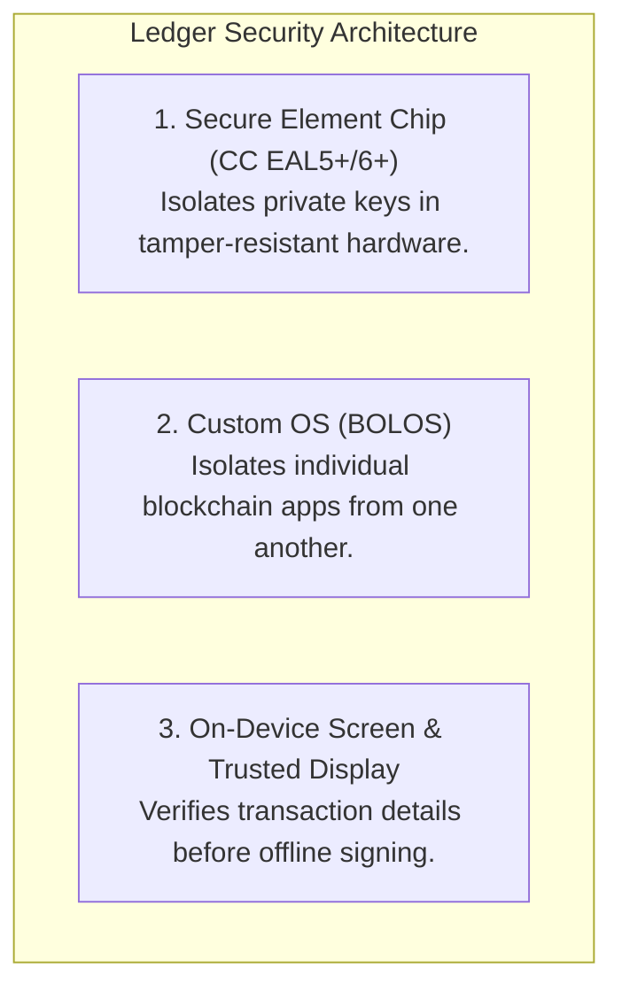
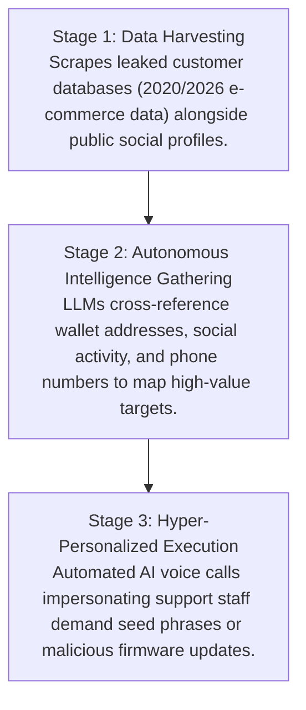

When Ledger launched in 2014, the crypto ecosystem was reeling from the collapse of Mt. Gox. Centralized exchanges had proved themselves to be single points of failure, and the motto "Not your keys, not your coins" became the core directive for digital asset security. Ledger entered the market with a promise: a vault that keeps your private keys entirely offline and out of reach from remote attackers.

Fast forward over a decade. Ledger has shipped over 8 million devices worldwide, securing an estimated 20% of global crypto market capitalization. Its product lineup—from the Nano S Plus and Nano X to the touchscreen Stax and Flex—is widely treated as an industry standard.

Yet as the asset class matures alongside rapid breakthroughs in artificial intelligence, a critical question warrants examination: **Is Ledger actually worth it, or does it give users a false sense of security?**

---

## 1. Security Architecture & The Engineering Behind Ledger

Ledger was founded in France by a collective of security, hardware, and cryptocurrency specialists—including Pascal Gauthier, Eric Larchevêque, Nicolas Bacca, and Joel Pobeda. The company maintains *The Ledger Donjon*, an internal red-team unit of security researchers who actively attack Ledger’s own hardware to discover vulnerabilities before malicious actors do.

The core selling point is the **Secure Element (SE)** chip—a certified hardware component (CC EAL5+ or EAL6+) similar to those used in passports and credit cards. Unlike standard microcontrollers, Secure Elements are engineered to resist physical intrusion, power-analysis exploits, and side-channel monitoring. Operating on top of this hardware is **BOLOS** (Blockchain Open Ledger Operating System), proprietary firmware that isolates individual crypto apps so an exploit in one token app cannot access keys stored elsewhere on the device.

---

## 2. Structural Risks: What Hardware Marketing Omits

While the Secure Element chip itself has not been remotely cracked in the wild, using a hardware wallet introduces non-technical and structural risks that users often overlook:

### A. Closed-Source Firmware & Key Extraction
Ledger’s firmware remains closed-source due to non-disclosure agreements with chip vendors. Consequently, users cannot independently audit the underlying codebase and must rely on Ledger’s internal engineering practices.

This trust model faced widespread community debate following the introduction of *Ledger Recover*. This optional service encrypts a user's recovery seed, splits it into three shards, and backs them up with third-party custodian companies. The architectural reality was clear: if firmware can be updated to export encrypted seed shards from the Secure Element, the hardware is technically capable of key extraction if compelled by regulatory pressure, software bugs, or compromised updates.

### B. Supply Chain & Customer Database Exposure
A hardware device exists within a broader corporate and logistics infrastructure.

- **The 2020 E-Commerce Database Leak:** Hackers breached Ledger's marketing and e-commerce databases, exposing the names, home addresses, and phone numbers of over 272,000 customers (alongside over 1 million email addresses).
- **The Global-e Breach:** In early 2026, Ledger confirmed an order-data exposure via its third-party cross-border payment processor, Global-e. Exposed customer order records once again surfaced target details for threat actors.
- **Physical Consequences:** Exposed database records directly enable home-invasion planning, targeted extortion, physical theft ("wrench attacks"), and physical mail phishing campaigns sent directly to customer residences.
- **The Structural Reality:** The underlying cryptographic keys on a device may remain intact, but if third-party database leaks reveal a user's physical address, operational security is compromised at the human layer.

---

## 3. History of Ecosystem Incidents

When evaluating Ledger's historical track record, it is necessary to distinguish between hardware-level key extraction and surrounding ecosystem breaches:

| Incident | Component Impacted | Operational Outcome |
| :--- | :--- | :--- |
| **2020 E-Commerce Leak** | Marketing / E-Commerce Database | 272k+ physical addresses & 1M+ emails exposed online. |
| **2023 Connect Kit Attack** | NPM Developer Software Library | $484,000+ stolen via malicious Web3 JavaScript injection. |
| **2026 Global-e Incident** | Third-Party Payment Processor | Customer order details and contact information exposed. |

While physical devices have kept private keys offline, the surrounding corporate, software, and logistical channels have repeatedly acted as vectors for compromise.

---

## 4. The Threat Vector: AI-Driven Phishing & Social Engineering

The primary threat vector facing hardware wallet users has migrated from software bugs to highly sophisticated, AI-driven social engineering.

Rather than attempting to crack EAL6+ chips directly, threat actors leverage artificial intelligence to compromise the user behind the device:

- **Real-Time AI Voice Cloning:** Generative audio models require only seconds of source audio—scraped from social media videos or public interviews—to synthesize indistinguishable human speech in real time. Scammers use these models to conduct interactive phone calls, posing as Ledger security representatives urging users to "verify" their seed phrases due to an active breach.
- **Context-Aware Phishing at Scale:** Large Language Models allow attackers to parse leaked e-commerce databases, cross-reference them with public blockchain records, and generate custom phishing communications matching a user's exact transaction history, location, and language.
- **Deepfake Video & Support Spoofing:** Synthetic video interfaces can replicate official support portals or executive calls, prompting users to connect their hardware wallets to compromised dApps or perform manual "firmware validations" that drain assets.

In an AI-enabled threat environment, the hardware device functions correctly, but the human operator is tricked into manually authorizing the asset transfer.

---

## 5. Core Operational Principles for Self-Custody

To maintain self-custody without relying unconditionally on a single hardware manufacturer, consider the following operational safeguards:

1. **Decouple Physical Identity from Hardware Purchases:** Purchase devices using non-residential addresses (such as a PO Box or commercial drop location) and alternative email aliases to ensure third-party database leaks do not tie physical locations to crypto holdings.
2. **Eliminate Single Points of Failure (Multisig Architectures):** Avoid storing significant capital behind a single seed phrase or a single manufacturer’s closed firmware. Utilizing a multi-signature setup (e.g., a 2-of-3 threshold requiring devices from distinct vendors like Ledger, Trezor, or ColdCard) ensures that a flaw, leak, or compromise in one brand does not result in loss of funds.
3. **Isolate On-Chain Approvals:** Treat transaction signing as a distinct risk from key storage. Hardware wallets do not prevent users from signing malicious smart contract approvals. Use dedicated, isolated hot wallets for daily Web3 interactions, reserving cold storage strictly for vault operations.
4. **Enforce an Absolute Zero-Trust Communication Rule:** Hardware wallet manufacturers, support desks, and logistics providers will never require a 24-word recovery phrase or PIN under any operational context. Any incoming call, message, or letter requesting seed input—regardless of how authentic the caller sounds—must be treated as an active attack vector.

---

## 6. The Verdict: Is Ledger Worth It?

**Yes—with strict operational boundaries.**

A Ledger remains worth using if the alternative is holding assets on centralized exchanges or inside unsecured browser extension wallets. It efficiently eliminates standard keyloggers, remote desktop exploits, and basic malware.

However, it is not an all-encompassing security solution. Hardware devices only protect the key at rest. They cannot protect against third-party database leaks, malicious smart-contract signatures, or AI-driven social engineering campaigns designed to manipulate the user into surrendering control. Trust in big crypto companies should always be tempered with strict operational discipline and decentralized security design.

***

### What Are Your Thoughts?

Do you trust single-vendor hardware wallets for long-term cold storage, or have recent database leaks and AI threat vectors changed your approach to self-custody? Leave your thoughts and opinions in the comments below.
