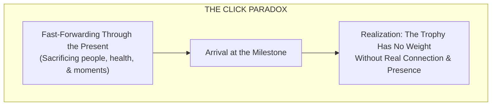

We spend years treating our lives like an airport terminal.

We sit on uncomfortable mental benches, eyes glued to an imaginary departure board, convinced that the real journey only begins once our row is called. We tell ourselves: *Once I earn this promotion, once I close this deal, once I make enough money—then I will finally exhale. Then the friction will disappear, and I can start paying attention to the people I love.*

In my early twenties, I lived almost entirely inside that waiting room.

I spent every waking hour trying to prove my worth to everyone around me. I tried to prove it to a partner I loved, constantly telling her, *"I’m not where I want to be yet, but just have faith."* I tried to prove it in how I dressed, how I talked, and the sheer volume of hours I poured into sales.

The irony was that I was terrible at sales at first because I was completely detached from the present moment. I was so fixated on who I wanted to become and what commission was on the other side that I lost the ability to truly connect with the human being sitting across from me. I believed the lie that hitting a specific title or financial milestone would magically erase all the exhaustion and pain.

It didn't.

When I finally reached the summit and owned my own sales business, the illusion shattered. I looked around the room at the people I had attracted: people who cared solely about closing the next client and maximizing profit, never about making a meaningful difference in someone’s life. Even worse, I looked back at the trail of wreckage I had left behind. I had pushed away family, claiming they *"just didn't understand the grind."* I had let close friendships wither. I had sacrificed a genuine relationship because my eyes were always locked on a horizon that never arrived.

It felt exactly like the movie *Click*. You fast-forward through the awkward dinners, the family arguments, the mundane mornings, and the quiet moments because you think you're working toward a future where it all pays off. Then you wake up at the end, holding the prize you thought you wanted, only to realize you sacrificed the actual substance of your life to get it.

**Status and numbers are completely hollow when there is no one left to share them with.**

---

## The Reality Behind the Horizon

Leaving that world behind wasn't clean or glamorous. Over the last decade, our identity shifted dozens of times. We moved across the country, starting over again and again.

There were seasons that never made it onto a social media feed—nights spent living out of a car parked along the busy, noisy streets of Nashville, navigating the exhaustion of survival, and learning the hard way what happens when people try to take advantage of your kindness.

During those seasons, the only stability we had was an unshakeable belief that we would survive. But survival alone isn't what brought color back to life. What saved us from losing our minds in the struggle was something entirely unglamorous: **a small, quiet flock of ducks.**

Keeping ducks offers no corporate promotion, no resume boost, and no financial return. Yet standing outside watching them just live anchored me in a way millions of dollars in sales never could.

They don’t stress over five-year plans. They don't lose sleep over what someone thinks of their status. They simply waddle through the grass, quack at the morning air, and jump into the air trying to catch a flying bug. To me, they are a daily chore; to them, I am their entire world.

That contrast changes how you view a Tuesday afternoon. It forces you to realize that life isn't happening on a spreadsheet; it's happening in the grass right in front of your boots.

---

## The Two Lenses of Everyday Life

Our environment today is beautiful, but not because every problem has vanished. We still build businesses, navigate Web3 and brand building, and do work that many people around us don't understand. People still carry rainclouds over their heads, waiting for some distant sunny day to drop the weight.

I choose not to carry that cloud anymore.

A grounded life recognizes that the present moment only ever presents two categories of experience:

1. **Things to savor directly:** The quiet cup of coffee on a day when no one is blowing up your phone, the ridiculous comedy of animals doing what they do, an uninterrupted conversation with someone who actually cares about you, or the simple relief of sleeping in a bed after knowing what the backseat of a car feels like.
2. **Things testing and tempering you:** The broken process that forces you to sharpen your focus, the difficult boundary you have to hold, or the sudden fire you have to put out. These aren't interruptions to your "real life"—they are the training ground that shapes who you are.

Both demand your presence. The good times ask for your genuine gratitude; the hard times ask for your respect and resilience.

---

## Stepping Out of the Queue

Ambition isn't a crime, and daydreaming about where you want to steer the ship is natural. But the quality of your mental health and the depth of the relationships you hold today are the only things that will make the destination worth reaching.

Learn to cherish the slow, mundane days where it feels like nothing is moving, because they balance out the days where the whole world is demanding your attention.

Stop fast-forwarding through the hard work, the quiet chores, and the people reaching out to you right now.

You don't need a promotion, an exit, or an external validation badge to start living. Look around at where your feet are planted today—in all its messy, unpolished, unpredictable reality. **You are already in the middle of your life. Start paying attention to it.**
